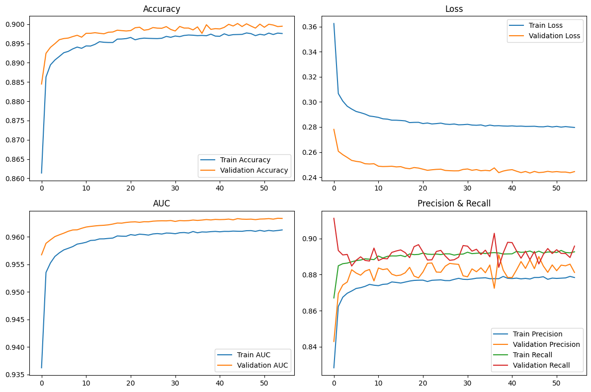

# README: Проект по предсказанию сердечных заболеваний

## Обзор проекта
Этот проект направлен на прогнозирование наличия сердечных заболеваний с использованием моделей машинного обучения. Набор данных включает такие характеристики пациентов, как возраст, пол, артериальное давление, уровень холестерина и другие клинические показатели. Цель - сравнить производительность моделей логистической регрессии, случайного леса и нейронной сети в прогнозировании сердечных заболеваний.

---

## Описание данных
- **Обучающие данные**: 600 000 записей с 15 столбцами (включая целевую переменную `class`).
- **Тестовые данные**: 400 000 записей с 14 столбцами (без целевой переменной).
- **Целевая переменная**: Бинарная (`0` - отсутствие болезни, `1` - наличие болезни).

### Ключевые признаки:
- **Числовые**: Возраст, Артериальное давление в покое, Уровень холестерина, Максимальная частота сердечных сокращений, Депрессия сегмента ST.
- **Категориальные**: Пол, Тип боли в груди, Уровень сахара натощак, Стенокардия при нагрузке, Наклон сегмента ST, Таллиевый стресс-тест.

---

## Предобработка данных
1. **Обработка выбросов**: Выбросы были идентифицированы, но сохранены, так как могут представлять клинически значимые случаи.
2. **Отрицательные значения**: Отрицательные значения в `oldpeak` (физиологически невозможные) заменены на `0`.
3. **Инжиниринг признаков**:
   - Редкие категории в `chest` объединены в "chest_other".
   - Перекодированы значения `thal` для исправления ошибок маркировки.
4. **Нормализация**: Числовые признаки стандартизированы с использованием `StandardScaler`.
5. **Анализ корреляции**: Удалены маловажные признаки (например, `fasting_blood_sugar`).

---

## Сравнение моделей
Были обучены и оценены следующие модели:

| Модель               | Точность | Точность (Precision) | Полнота (Recall) | F1-мера | ROC-AUC |
|---------------------|----------|-----------|--------|----------|---------|
| Логистическая регрессия | 0.880    | 0.880     | 0.860  | 0.870    | 0.952   |
| Случайный лес       | 0.897    | 0.898     | 0.876  | 0.887    | 0.960   |
| Нейронная сеть      | 0.899    | 0.885     | 0.889  | 0.887    | 0.963   |

**Лучшая модель**: Нейронная сеть показала наивысшую точность (0.899) и ROC-AUC (0.963).

---

## Ключевые инсайты
### Важность признаков
1. **Наиболее значимые признаки**:
   - `thal_6` (Таллиевый стресс-тест - Фиксированный дефект)
   - `chest_grouped_chest_4` (Атипичная боль в груди)
   - `number_of_major_vessels` (Количество крупных сосудов)
   - `maximum_heart_rate_achieved` (Обратная корреляция с болезнью)

2. **Малозначимые признаки**:
   - `fasting_blood_sugar` (Крайне низкая корреляция)
   - `resting_electrocardiographic_results_1` (Минимальное влияние)

### Дисбаланс классов
- Наблюдался умеренный дисбаланс (56% здоровых vs 44% с болезнью). Для решения использовались методы взвешивания классов.

---

## Графики обучения (Нейронная сеть)
  
*Графики включают точность, потери, AUC, точность и полноту по эпохам.*

---

## Как использовать
### Требования
- Python 3.10+
- Библиотеки: `pandas`, `numpy`, `scikit-learn`, `tensorflow`, `matplotlib`, `seaborn`.

### Инструкция
1. **Подготовка данных**:
   - Запустите скрипт предобработки для очистки и нормализации данных.
   ```bash
   python preprocess.py
   ```

2. **Обучение моделей**:
   - Обучите модели с помощью предоставленных скриптов.
   ```bash
   python train_logistic.py
   python train_random_forest.py
   python train_neural_network.py
   ```

3. **Прогнозирование**:
   - Используйте лучшую модель (Нейронная сеть) для предсказаний:
   ```bash
   python predict.py --input test_data.csv --output predictions.csv
   ```

### Веса лучшей модели
Скачайте веса обученной нейронной сети:  
[best_model.keras](Heart_prediction/best_model.keras)

---

## Ссылки и литература
- Результаты согласуются с литературой, особенно по важности `thal_6` и признаков боли в груди (Chang et al., 2022).
- Инструменты: Scikit-learn, TensorFlow, Pandas и Matplotlib использовались для анализа и визуализации.

---
## Структура проекта
```
heart_pred/
├── data/
│   ├── train.csv
│   └── test.csv
├── notebooks/
│   └── analysis.ipynb
├── scripts/
│   ├── preprocess.py
│   ├── train_logistic.py
│   ├── train_random_forest.py
│   ├── train_neural_network.py
│   └── predict.py
├── models/
│   └── best_model.keras
├── README.md
└── requirements.txt
```

---

### Скрипт для инференса (predict.py)
```python
import pandas as pd
import tensorflow as tf
from sklearn.preprocessing import StandardScaler
import argparse

def load_model(model_path):
    return tf.keras.models.load_model(model_path)

def preprocess_data(input_path):
    data = pd.read_csv(input_path)
    # Применяем те же шаги предобработки, что и при обучении
    data['oldpeak'] = data['oldpeak'].apply(lambda x: max(x, 0))
    # Другие шаги предобработки...
    return data

def main():
    parser = argparse.ArgumentParser()
    parser.add_argument('--input', required=True, help='Path to input CSV file')
    parser.add_argument('--output', required=True, help='Path to save predictions')
    args = parser.parse_args()

    model = load_model('models/best_model.keras')
    data = preprocess_data(args.input)
    
    predictions = (model.predict(data) > 0.5).astype(int).flatten()
    pd.DataFrame(predictions, columns=['predictions']).to_csv(args.output, index=False)

if __name__ == '__main__':
    main()
```